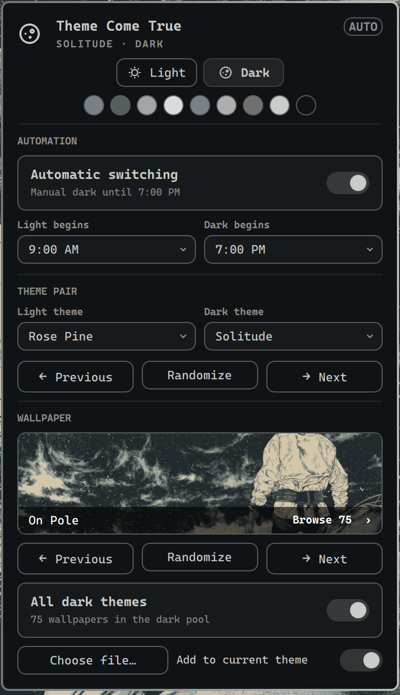

# Theme Come True

An Omarchy menu bar plugin for switching light/dark mode and the theme and/or wallpaper.



## Features

- Choose a light theme and a dark theme, or cycle and randomize compatible themes.
- Preview the active theme's accent and terminal colors.
- Browse wallpapers from the active theme or every theme in the current mode.
  Use a personal image directly, or add a copy to the active theme.
- Restore remembered wallpapers when switching themes or modes. Previous returns
  through recent wallpaper and random-theme choices.
- Switch automatically at fixed times, sunrise/sunset, or a mix of both.
- Change the wallpaper, shell colors, and menu together using Omarchy's native
  transition while its application updates finish.

## Install

```bash
omarchy plugin add https://github.com/mapleroyal/theme-come-true.git --enable
```

Requires Python 3.11+, Quickshell, and Omarchy's plugin and theme commands.
Tested with Omarchy 4.0.2-1 and Quickshell 0.3.1-1.
Solar scheduling uses Open-Meteo for sunrise/sunset and wttr.in to resolve a
location when Omarchy’s weather settings do not provide coordinates.
Manual switching and fixed-time schedules work without these services.

## Use

Click the sun/moon icon to open the menu. Right-click it to toggle light/dark
mode; middle-click it to advance the wallpaper. Click the wallpaper preview
to open Omarchy's fullscreen image picker.

Theme pairs, schedules, and remembered wallpapers survive shell reloads.
Previous/random history lasts for the current shell session.

For keyboard shortcuts, open the menu on the focused monitor with
`omarchy-shell shell toggle io.github.mapleroyal.theme-come-true '{}'`, or toggle modes with
`omarchy-shell appearance toggle`.

See [the architecture and development guide](ARCHITECTURE.md) for integration
details, compatibility assumptions, and validation commands. The plugin leaves
packaged files under `/usr/share/omarchy` unchanged.

## Remove

```bash
omarchy plugin remove io.github.mapleroyal.theme-come-true
```

Your current theme, wallpapers, and imported personal images remain in place.

## License

Plugin code is [MIT licensed](LICENSE). Bundled MingCute icons retain their
Apache-2.0 license; the screenshot shows Omarchy’s Solitude theme and On Pole
wallpaper, which are not covered by the plugin’s MIT license.

## Artwork

The sun and full-moon icons come from
[MingCute Icons](https://github.com/mingcute-design/mingcute-icons).
See [the icon notice](assets/icons/NOTICE.md) for attribution and licensing.
